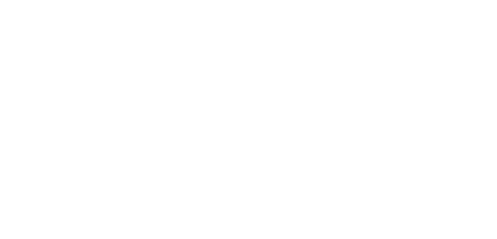
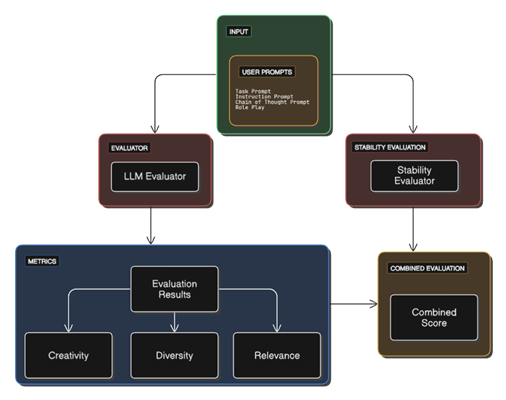
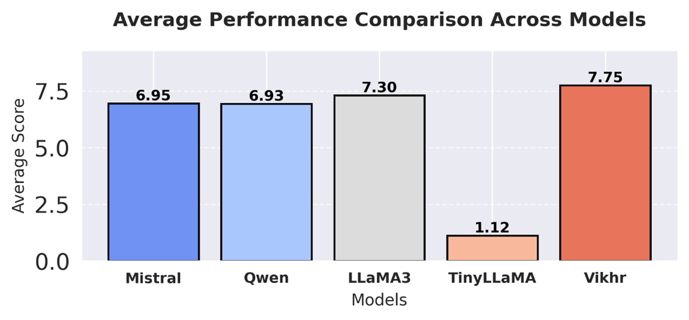
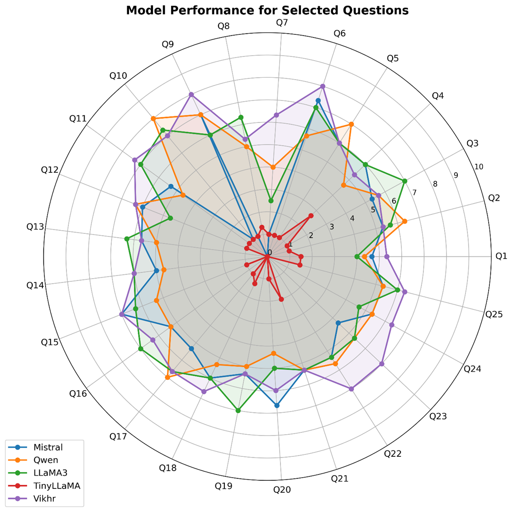

# RuSimulBench: Russian Language Benchmark for LLMs

<p align="center">
  
</p>

<p align="center">
    <a href="https://opensource.org/licenses/MIT">
    
    </a>
    <a href="https://github.com/MrSimple07/RuSimulBench/">
    
    </a>
</p>

<h2 align="center">
    <p>RuSimulBench is a new open benchmark for the Russian language for evaluating fundamental models.</p>
</h2>

## Overview

In recent years, Large Language Models (LLMs) have made significant strides in natural language processing (NLP), demonstrating remarkable capabilities in text generation, reasoning, and domain-specific adaptations. These advancements have led to widespread applications in content creation, machine translation, and conversational AI.

However, while English-language models benefit from well-established evaluation frameworks, Russian LLMs lack standardized benchmarks that measure their ability to generate high-quality, contextually appropriate, and robust responses. This gap poses a challenge in improving and fine-tuning Russian LLMs for real-world applications.

## Evaluation Framework

Our evaluation framework consists of several components working together to assess model performance:



The framework processes user prompts through both LLM and stability evaluators, measuring key metrics including creativity, diversity, and relevance before calculating a combined score.

## Why This Benchmark?

Existing benchmarks primarily assess general language understanding but do not account for complex aspects such as **creativity** and **stability**, which are critical for advanced AI applications, including content generation and decision-support systems.

- **Creativity** ensures that models generate diverse and original responses while maintaining contextual relevance.
- **Stability** ensures consistency in model behavior when faced with slight variations in input prompts, making AI models more reliable and trustworthy.

## Benchmark Results

We evaluated several leading LLMs on our benchmark, with the following average performance:



As shown in the chart, Vikhr (7.75) outperforms other models including LLaMA3 (7.30), Mistral (6.95), Qwen (6.93), and TinyLLaMA (1.12).

For specific question performance across our benchmark:



The radar chart shows detailed performance on 25 different questions, illustrating how each model performs across various tasks and revealing that TinyLLaMA (red) consistently underperforms compared to other models.

## Benchmarked Models

For both stability and creativity assessments, we benchmarked the following language models:

- **Vikhr-Nemo-12B** – Vikhr 12B, fine-tuned using NVIDIA's NeMo framework
- **Saiga-LLaMA3-8B** – Based on LLaMA 3, an 8B-parameter version, fine-tuned as Saiga
- **Mistral-Nemo** – Based on Mistral 7B, fine-tuned by NVIDIA's NeMo framework
- **Qwen2.5-7B** – Qwen 2.5 series, a 7B-parameter model from Alibaba
- **TinyLLaMA-1.1B** – A lightweight TinyLLaMA model with 1.1B parameters

## Evaluation Methodology

### Stability Evaluation

For stability evaluation, we selected four tasks from the MERA benchmark: Chegeka, LCS, ruDetox, and ruOpenBookQA. Each task consisted of ten variations of prompt texts to analyze model stability when faced with different formulations of the same question. Generation was configured with a temperature of 0 to focus on model consistency.

The stability score is calculated as:

```
S = ((∑(i≠j) similarity_ij - n)/(n·(n-1)))·P
```

Where:
- similarity_ij represents the cosine similarity between response embeddings
- n is the total number of prompt variations per question (n=10 in our experiments)
- P is the answer probability based on token probabilities in the generated response

### Creativity Evaluation

For creativity assessment, we employed Google's Gemini Flash model as an evaluator, generating three independent assessments per task.

The Creativity Score (CS) is calculated as:

```
CS = α·Creativity + β·Diversity + γ·Coherence
```

Where:
- α = 0.4 (Creativity was prioritized for originality and novelty)
- β = 0.3 (Diversity was weighted to capture stylistic range)
- γ = 0.3 (Coherence ensured logical consistency)
- Each component is normalized to a scale of [0,10]

### Combined Score

The Combined Evaluation Score (CES) brings together both aspects:

```
CES = (Normalized Creativity Score + Stability Coefficient)/2
```

## Key Features

- **Standardized evaluation methodology** for Russian LLMs
- **Focus on creativity and stability** for advanced AI applications
- **Publicly available** for research and development

## Demo

Check out the **RuSimulBench Arena** on 🤗 HuggingFace:
[](https://huggingface.co/spaces/MrSimple01/RuSimulBench_arena)

## Tasks & Datasets

Our benchmarking framework leverages:
- [Awesome ChatGPT Prompts](https://github.com/f/awesome-chatgpt-prompts) 📝
- [MERA: Russian LLM Evaluation](https://github.com/ai-forever/MERA) 🏆
- [SimulBench](https://github.com/SimulBench/SimulBench) 📖

## Installation & Usage

To use our benchmarking framework, clone this repository and follow the instructions:

```bash
# Clone the repository
git clone https://github.com/rusimulbench.git
cd rusimulbench

# Install dependencies
pip install -r requirements.txt

# Run the benchmark
python stability_evaluator.py
```

## Contributing

We welcome contributions! Feel free to open issues or submit pull requests to improve the benchmark.

## License

This project is licensed under the MIT License.

## Contact

abdurahimov.muslimbek@gmail.com
